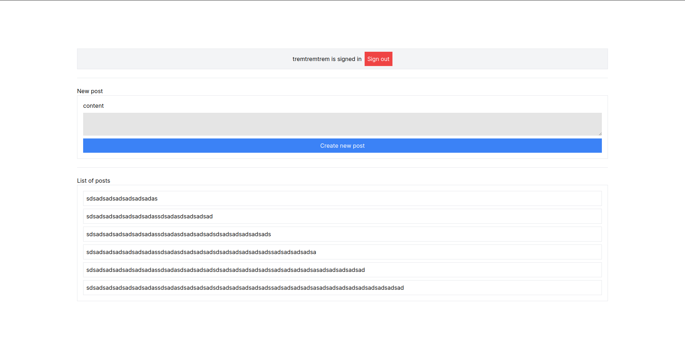

# Next.js with Lucia for Auth and Drizzle ORM + SQLite app using server actions (Oversimplified example)

In that app you can see a simple protected server action for creating "posts". We use Lucia for authentication and Drizzle ORM + SQLite for the database. The objective of this example is to show how to use Lucia with server actions.

> Most of the app is just a copy of the [Sign in with username and password in Next.js App Router](https://lucia-auth.com/guidebook/sign-in-with-username-and-password/nextjs-app). The only difference is the server action, database and the fact that we use Drizzle ORM instead of Prisma.There is some styling added to the app, but it's not the focus of this example.



## Getting Started

First, run the development server:

```bash
npm run dev
# or
yarn dev
# or
pnpm dev
# or
bun dev
```

Open [http://localhost:3000](http://localhost:3000) with your browser to see the result.
